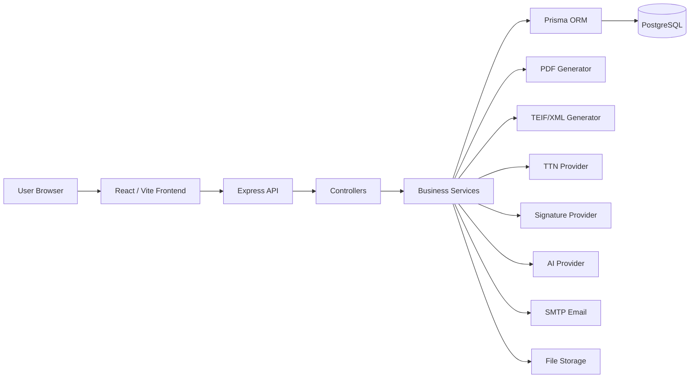

# InvoicePro

Professional SaaS platform for business invoicing, client management, payments tracking, administration, and electronic invoicing preparation.

## 1. Overview

InvoicePro is a SaaS platform that helps businesses manage their commercial workflow from one place. It brings together clients, products and services, quotes/devis, invoices, payments, reports, company settings, notifications, support requests, audit logs, admin access management, electronic invoicing preparation, and AI assistance when configured.

The platform is built for business owners, finance teams, accountants, and platform administrators who need a structured application for day-to-day invoicing operations and supervised electronic invoicing workflows.

## 2. Platform Purpose

InvoicePro centralizes business invoicing operations and provides a structured workflow for creating invoices, tracking payments, managing clients, preparing electronic invoice data, and supervising user access from the admin side.

The product separates commercial invoice management from official electronic validation workflows. This allows teams to manage operational invoicing, payment follow-up, document exports, and compliance preparation without mixing payment status with TTN or electronic signature status.

## 3. Main Features

| Feature | Description |
| --- | --- |
| Authentication | User registration, user login, admin login, JWT sessions, and protected routes. |
| Client dashboard | Business overview for invoices, payments, workflow activity, and key metrics. |
| Admin control center | Central supervision area for accounts, support, configuration, activity, and platform indicators. |
| Clients management | Create, update, and manage customer records with fiscal and contact information. |
| Products/services management | Manage reusable products and services used in quotes and invoice lines. |
| Quotes/devis | Create and manage commercial quotes before invoice creation. |
| Invoices | Create, edit, validate, export, email, and follow invoices. |
| Invoice tracking | Visual tracking of invoice progress through commercial and electronic invoicing steps. |
| Payments | Record invoice payments, partial payments, remaining balances, and payment status. |
| Reports | View commercial and financial reporting based on invoice and payment data. |
| Settings | Manage company profile, security, compliance settings, subscription view, help access, and team area. |
| Notifications | Display workflow notifications and route users to related pages. |
| Support requests | User support area and admin support management. |
| Audit logs | Trace important user, company, and admin actions. |
| AI assistant | Gemini-powered assistant activated through backend API key configuration. |
| Electronic invoicing workflow | TEIF/XML generation, signature step, TTN submission step, and status tracking. |
| TTN configuration | Environment and admin-managed settings for TTN endpoints and credentials. |
| Signature configuration | Certificate or provider-based configuration for electronic signature workflows. |
| Subscription/account access management | Account status, approval, access periods, invoice quota, and admin supervision. |

## 4. User Types and Roles

### A. Visitor

Visitors can access public pages such as the landing page, demo page, pricing page, e-invoice guide, legal pages, login, and registration. Visitors cannot access the private dashboard or company data.

### B. Business User / Client Account

Business users access the protected application workspace after authentication and account access validation. They can manage business data, create clients, create products and services, create quotes/devis, create invoices, track payments, view reports, configure company information, and use the AI assistant when the provider key is configured and the account plan allows it.

### C. Company Owner / Main Account

The company owner owns the company workspace and has access to company-level data. The owner manages company profile information, invoicing settings, subscription/access status where available, and electronic invoicing configuration. Owner-level access is also accepted by backend permission guards for sensitive company actions.

### D. Admin / Platform Administrator

Admins access a separate admin control center using admin authentication. Platform administrators can approve accounts, block accounts, unblock accounts, manage account access days, review support requests, manage external configuration, view activity logs, and supervise platform-level activity.

### E. External Systems

External systems are technical actors integrated through backend configuration:

- TTN system for electronic invoice submission and status tracking when official access is configured.
- Signature provider or certificate service for electronic signature workflow.
- Google Gemini for AI assistant responses when the API key is configured.
- SMTP provider for email delivery.
- Payment or billing provider when connected for SaaS billing or online payment flows.

## 5. Pages and Functional Areas

### Public Pages

| Page | Route | Purpose | Main actions | Related backend/data |
| --- | --- | --- | --- | --- |
| Landing page | `/` | Presents InvoicePro and directs visitors to registration, login, demo, and guides. | Navigate to public and auth pages. | Analytics events may be tracked by the frontend. |
| Login | `/login` | Authenticates business users. | Submit email/password and receive user token. | `/api/auth/login`, Company, Subscription, AdminCompanyProfile. |
| Register | `/register` | Creates a business account. | Submit company/user details and start account access workflow. | `/api/auth/register`, Company, Subscription. |
| Demo | `/demo` | Public product demonstration page. | View product walkthrough content. | Frontend page. |
| Pricing | `/pricing`, `/tarifs` | Shows plan-oriented product information. | Navigate to registration or contact. | Frontend page, subscription labels. |
| E-invoice guide | `/e-invoice-guide` | Explains electronic invoicing concepts, TEIF, signature, and TTN workflow. | Read guide sections and source links. | Frontend page. |
| Signature and TTN guide | `/signature-ttn` | Public and protected guidance for signature and TTN preparation. | Submit onboarding-related requests where available. | `/api/onboarding`. |
| Public offer page | `/public/offers/:token` | Displays a shared offer by token. | View public offer details. | `/api/public`. |
| Legal pages | `/privacy`, `/terms`, `/legal`, `/contact` | Provides legal and contact information. | Read public content or contact information. | Frontend pages. |

### User Area

| Page | Route | Purpose | Main actions | Related backend/API/data |
| --- | --- | --- | --- | --- |
| Dashboard | `/dashboard` | Main overview for company activity. | Review metrics, workflow shortcuts, and recent activity. | `/api/dashboard`, invoices, payments, clients. |
| Clients | `/clients` | Manage customer records. | Create, update, delete, import, and search clients. | `/api/clients`, Client. |
| Products | `/products` | Manage products and services. | Create, update, delete, upload image, and use tax rates. | `/api/products`, Product, TvaRate. |
| Invoices | `/invoices` | Main invoice workspace. | Create/edit invoice, validate status, generate PDF, generate XML, sign TEIF, submit/check TTN, email invoice, record payments. | `/api/invoices`, Invoice, InvoiceLine, Client, Product, Payment. |
| Invoice Tracking | `/invoice-tracking`, `/suivi-factures` | Workflow view for invoice progress. | Continue invoice editing, generate TEIF/XML, sign, submit/check TTN, download final PDF when available. | `/api/invoices`, compliance metadata. |
| Payments / Reglements | `/payments`, `/reglements` | Track invoice settlements. | Create payment, update payment status, review remaining amount. | `/api/payments`, `/api/invoices/:id/payments`, Payment. |
| Quotes / Devis | `/devis`, `/quotes`, `/mes-devis` | Manage commercial quotes. | Create quote, add lines, generate/send documents, convert accepted quote into invoice. | `/api/devis`, Devis, DevisLine, Invoice. |
| Reports | `/reports` | Business reporting. | Review revenue, invoice, payment, and performance data. | `/api/reports`. |
| Settings | `/settings` | Company, security, compliance, subscription, help, and team settings. | Update profile, password, logo, certificate, e-invoice settings, and help links. | `/api/settings`, SettingsHistory, Company. |
| Notifications | Layout notification area | User workflow notifications. | View unread count, open related pages, mark as read. | `/api/notifications`, Notification. |
| Assistant IA | `/ai` | AI assistant for platform and invoicing guidance. | Send prompts and receive Gemini responses. | `/api/ai`, AiMonthlyUsage. |
| Messages / Network | `/messages`, `/network`, `/reseau`, `/reseau-professionnel` | Professional network and messaging features. | Manage connections and messages. | `/api/network`, `/api/messages`, PartnerConnection, PartnerMessage. |
| Opportunities and projects | `/opportunities`, `/projects`, `/mes-projets`, `/offers`, `/mes-offres`, `/demandes` | Business opportunity, project, request, and offer workflows. | Create and manage commercial opportunities, offers, and project requests. | `/api/opportunities`, `/api/projects`, `/api/offers`. |
| Support / Help | `/help`, `/support` | User help and support request area. | Read help content and create support requests. | `/api/support`. |
| Audit Trail | `/historique`, `/audit-trail` | User-facing traceability page. | Review activity logs by object type and action. | `/api/audit-trail`, UserActivityLog, ActivityLog. |

### Admin Area

The admin area uses a separate admin token and admin protected routes.

| Page | Route | Purpose | Main actions | Related backend/API/data |
| --- | --- | --- | --- | --- |
| Admin login | `/admin/login` | Authenticates platform admins. | Submit admin credentials and receive admin token. | `/api/admin/auth` through admin routes, Admin. |
| Control Center | `/admin`, `/admin/dashboard` | Global account and platform overview. | Review account totals, pending accounts, active accounts, blocked accounts, support requests, and configuration alerts. | `/api/admin`, Company, Subscription, AdminCompanyProfile, AdminSupportTicket. |
| Accounts | `/admin/companies`, `/admin/users` | Account supervision. | Approve account, block account, unblock account, suspend/delete account where available, add access days, and manage account status. | `/api/admin`, Company, Subscription, AdminCompanyProfile, status history models. |
| Configuration | `/admin/settings`, `/admin/integrations`, `/admin/ttn`, `/admin/compliance` | External service and compliance configuration. | Manage TTN settings, AI provider key, payment/billing provider, signature/e-invoice configuration, and SMTP settings. | `/api/admin`, IntegrationSecret, SystemSetting. |
| Support Requests | `/admin/support` | Support request management. | Review user requests, update status, and reply where enabled. | `/api/admin`, AdminSupportTicket, AdminSupportReply. |
| Audit Logs | `/admin/activity`, `/admin/activity-logs` | Platform activity traceability. | Review important platform and admin actions. | `/api/admin`, ActivityLog, UserActivityLog. |
| Admin invoices/payments/subscriptions | `/admin/invoices`, `/admin/payments`, `/admin/subscriptions` | Operational supervision pages for commercial and billing data. | Review invoice, payment, and subscription information. | `/api/admin`. |
| System and analytics | `/admin/system-errors`, `/admin/analytics-seo` | Technical and analytics supervision. | Review system errors and analytics/SEO integration settings. | `/api/admin`, AdminSystemError, AnalyticsEvent. |

## 6. Technical Stack

| Layer | Technology | Purpose |
| --- | --- | --- |
| Frontend | React 19 | User interface, routing, stateful pages, and protected views. |
| Frontend build tool | Vite 8 | Local development server and production frontend build. |
| Styling | Tailwind CSS, custom CSS, lucide-react | Responsive UI, layout utilities, and icons. |
| API communication | Axios | REST calls from frontend to backend with JWT Authorization headers. |
| Backend | Node.js, Express 5, TypeScript | REST API, business logic, security middleware, and integrations. |
| Database | PostgreSQL | Persistent storage for companies, invoices, payments, users, configuration, and logs. |
| ORM | Prisma | Database schema, migrations, generated client, and typed data access. |
| Authentication | JWT, bcryptjs | User/admin tokens and password hashing. |
| Validation/security | express-validator, helmet, cors, express-rate-limit | Request validation, HTTP headers, CORS, and registration throttling. |
| PDF generation | pdfkit | Invoice and document PDF generation. |
| XML/TEIF generation | xmlbuilder2, custom TEIF utilities | Structured electronic invoice XML generation. |
| Signature utilities | node-forge, certificate/provider services | Electronic signature workflow support. |
| AI provider | Google Gemini via `@google/generative-ai` | AI assistant responses when `GEMINI_API_KEY` is configured. |
| Email provider | Nodemailer with SMTP | Email delivery for documents and communication. |
| File upload/storage | multer, fs-extra, local uploads directory | Logo uploads, XML import, generated artifacts, and certificate upload handling. |
| Deployment | Docker, Docker Compose, Node.js process, Nginx frontend container | Local and production deployment options. |
| Charts and exports | Recharts, xlsx, jsPDF, html2canvas | Reporting, spreadsheet import/export, and frontend document utilities. |

## 7. Project Structure

```text
invoicepro/
├── backend/
│   ├── prisma/
│   │   ├── migrations/
│   │   ├── schema.prisma
│   │   └── seed.cjs
│   ├── scripts/
│   ├── src/
│   │   ├── config/
│   │   ├── controllers/
│   │   ├── middleware/
│   │   ├── routes/
│   │   ├── services/
│   │   ├── utils/
│   │   ├── index.ts
│   │   └── prisma.ts
│   ├── uploads/
│   ├── docker-compose.yml
│   ├── Dockerfile
│   ├── package.json
│   └── tsconfig.json
├── frontend/
│   ├── public/
│   ├── src/
│   │   ├── assets/
│   │   ├── components/
│   │   ├── context/
│   │   ├── i18n/
│   │   ├── pages/
│   │   ├── services/
│   │   ├── utils/
│   │   ├── App.jsx
│   │   └── main.jsx
│   ├── Dockerfile
│   ├── nginx.conf
│   ├── package.json
│   └── vite.config.js
├── docker-compose.prod.yml
├── CPANEL_DEPLOYMENT.md
├── EINVOICE_SIGNATURE_TTN_VERIFICATION.md
└── README.md
```

### Folder Notes

- `backend/src/routes`: REST route definitions grouped by domain.
- `backend/src/controllers`: HTTP request handlers.
- `backend/src/services`: business workflows and integration logic.
- `backend/src/middleware`: authentication, authorization, validation, error handling, and subscription guards.
- `backend/src/utils`: PDF, XML, signature, notification, mail, and numbering helpers.
- `backend/prisma`: Prisma schema, migrations, and seed scripts.
- `frontend/src/pages`: route-level React pages for public, user, and admin areas.
- `frontend/src/components`: reusable layout and UI components.
- `frontend/src/services/api.js`: Axios client used by the frontend.
- `frontend/src/context`: user, admin, and language context providers.
- `frontend/src/i18n`: translation dictionaries.

## 8. Platform Architecture

InvoicePro follows a standard client/server architecture:

```text
Browser / React frontend
-> Axios API calls
-> Express REST API
-> Controllers
-> Business services
-> Prisma ORM
-> PostgreSQL database
```

External service integrations are handled from the backend service layer. The frontend never receives private provider keys or certificate secrets.



## 9. Frontend and Backend Communication

The frontend uses `frontend/src/services/api.js`, an Axios client configured with `VITE_API_URL`. Request interceptors attach the user token or admin token from local storage:

- User token: `token`
- Admin token: `adminToken`

Protected user routes send `Authorization: Bearer <token>`. Admin routes under `/api/admin` send `Authorization: Bearer <adminToken>`.

The backend validates tokens through middleware:

- `protect` validates company/user access.
- `adminProtect` validates admin access.
- Permission guards validate role-sensitive actions such as invoice creation, TEIF generation, signature, and TTN submission.

### Communication Examples

| Flow | Frontend action | API behavior | Result |
| --- | --- | --- | --- |
| Login flow | User submits credentials on `/login`. | Backend validates password, signs JWT, and returns user data. | Frontend stores token and opens the protected workspace. |
| Create client flow | User submits client form. | `/api/clients` creates a company-scoped client. | Frontend refreshes client list. |
| Create invoice flow | User selects client and invoice lines. | `/api/invoices` creates invoice and invoice lines after quota and role checks. | Invoice appears in invoice list and dashboard data. |
| Generate PDF/XML flow | User clicks document action. | Backend generates PDF or TEIF/XML through invoice utilities and services. | Browser downloads document or UI shows updated workflow status. |
| Payment flow | User records payment against invoice. | Backend stores payment and recalculates paid/remaining amount. | Payment status is updated in UI. |
| Notification flow | Backend creates notification for relevant event. | Frontend reads `/api/notifications`. | User sees unread count and can open related page. |
| Admin approve account flow | Admin changes account status. | Admin API updates company profile/subscription records and activity logs. | User access follows the updated status. |

## 10. Authentication and Authorization

InvoicePro uses JWT-based authentication for both business users and platform admins.

User access:

- Business users authenticate through auth routes and receive a JWT.
- Protected user API routes require the `protect` middleware.
- Company data is scoped by the authenticated company ID.
- Account access is checked against profile/subscription status.

Admin access:

- Admins authenticate separately and receive an admin JWT.
- Admin API routes require admin middleware.
- Admin users are stored separately from company accounts.

Authorization:

- Passwords are hashed with bcrypt.
- JWT secrets are loaded from backend environment configuration.
- Role-sensitive company actions use `requireCompanyRole`.
- Electronic invoicing actions use `requireEInvoicePermission`.
- Admin and user routes are separated in both frontend routing and backend middleware.

## 11. Database and Main Models

The application uses PostgreSQL through Prisma. Main models from `backend/prisma/schema.prisma` include:

| Model | Purpose |
| --- | --- |
| Company | Business account, company identity, authentication base, and workspace owner. |
| Admin | Platform administrator account. |
| Subscription | Plan, account access, invoice quota, and subscription status. |
| ActivityLog | Platform-level activity and admin traceability. |
| FailedLoginAttempt | Login protection data. |
| AiMonthlyUsage | Monthly AI usage tracking per company. |
| IntegrationSecret | Stored integration settings and secrets managed from admin configuration. |
| AnalyticsEvent | Frontend/product analytics events. |
| AdminCompanyProfile | Admin-side company profile and account status. |
| AdminCompanyNote | Admin notes related to company accounts. |
| AdminSupportTicket | Admin-managed support ticket. |
| AdminSupportReply | Replies on admin support tickets. |
| AdminSystemError | Stored system error records for admin supervision. |
| AdminPlatformPayment | Platform-side payment/subscription records. |
| AdminDossierStatusHistory | History of dossier/compliance status changes. |
| AdminCompanyStatusHistory | History of admin account status changes. |
| SystemSetting | Platform settings. |
| TvaRate | VAT/TVA rates used by products and invoice lines. |
| Client | Customer record for a company. |
| Product | Product/service catalog item. |
| Devis | Quote/devis document. |
| DevisLine | Quote/devis line item. |
| Invoice | Invoice document, totals, payment state, and electronic workflow state. |
| InvoiceLine | Invoice line item. |
| Offer | Commercial offer record. |
| OfferComment | Comments attached to offers. |
| Payment | Payment record linked to invoice and company. |
| InvoiceRequest | Request workflow related to invoicing. |
| Notification | User notification record. |
| DocumentSequence | Business document numbering sequences. |
| SettingsHistory | Company settings change history. |
| UserActivityLog | User-facing audit trail. |
| SignatureProviderOption | Available signature provider options. |
| OnboardingRequest | Onboarding/support request for TTN or signature preparation. |
| PlatformInvitation | Platform invitation records. |
| PartnerConnection | Network connection between partners. |
| PartnerMessage | Message exchanged through the network module. |

Enums include `DevisStatus`, `InvoiceStatus`, `InvoiceRequestStatus`, and `DocumentSequenceType`.

## 12. Business Workflows

### A. Account Creation and Admin Approval

1. A visitor registers a business account.
2. The backend creates company and subscription-related records.
3. Access status is evaluated by middleware on protected routes.
4. Admin reviews accounts from the admin control center.
5. Admin can approve, block, unblock, adjust status, or add access days.
6. User access follows the updated account/subscription status.

### B. Client Management

1. User creates a client record.
2. User can edit or remove company-scoped clients.
3. Clients are selected in quotes/devis and invoices.
4. Fiscal and contact information is reused in generated documents.

### C. Product/Service Management

1. User creates product or service catalog items.
2. Each item can include code, description, price, VAT rate, and image.
3. Products can be selected in invoice or quote lines.
4. Line descriptions and prices are populated from catalog data.

### D. Quote/Devis Workflow

1. User creates a devis.
2. User adds client and line items.
3. Totals are calculated from quantities, unit prices, and TVA.
4. Document actions can generate or send commercial documents where enabled.
5. Accepted business can be converted into invoice records.

### E. Invoice Workflow

1. User creates an invoice with client and lines.
2. Backend calculates totals, TVA, stamp duty, and net amount.
3. User can edit draft or rejected invoices.
4. User validates invoice data.
5. User can generate draft PDF and TEIF/XML.
6. User can continue into signature and TTN workflow when configured.
7. Payment tracking remains available as a commercial workflow.

### F. Payment Workflow

1. User records a payment against an invoice.
2. Backend calculates total paid and remaining amount.
3. Invoice payment status can be unpaid, partially paid, or paid.
4. Payment state remains separate from electronic/legal workflow state.

### G. Notification Workflow

1. Backend creates a notification for workflow or system events.
2. Frontend displays unread notifications in the layout.
3. User can open the related page when a target route is available.
4. Notifications can be marked as read.

### H. Support Request Workflow

1. User creates or sends a support request.
2. Admin reviews the request from the support area.
3. Admin can update status and reply where enabled.
4. Support activity is retained for platform supervision.

## 13. Electronic Invoicing Workflow

InvoicePro prepares and manages a structured electronic invoicing workflow:

```text
Invoice preparation
-> XML/TEIF generation
-> electronic signature step
-> TTN submission step
-> TTN status tracking
-> final status update
```

Official TTN submission depends on configured TTN credentials, endpoints, and production access. Electronic signature depends on the configured certificate or signature provider. Payment status is independent from electronic/legal status.

The workflow is implemented through invoice endpoints and `teifWorkflowService`, which coordinates validation, XML generation, signature, TTN provider calls, response tracking, and final document availability.

## 14. TTN Integration Configuration

TTN integration is handled as an external service configuration. TTN access must be provided by the official service provider and configured through environment variables or admin configuration according to the deployment mode.

| Variable | Purpose |
| --- | --- |
| `E_INVOICE_MODE` | Electronic invoicing mode used by backend configuration. |
| `TTN_MODE` | Alternative mode variable read by backend configuration. |
| `TTN_API_URL` | TTN API URL used by admin/configuration views. |
| `TTN_BASE_URL` | TTN provider base URL used by readiness checks and provider setup. |
| `TTN_AUTH_MODE` | Authentication mode label for TTN configuration. |
| `TTN_AUTH_ENDPOINT` | TTN authentication endpoint. |
| `TTN_SUBMIT_INVOICE_ENDPOINT` | TTN invoice submission endpoint. |
| `TTN_STATUS_ENDPOINT` | TTN submission status endpoint. |
| `TTN_PROOF_ENDPOINT` | TTN proof/reference/QR endpoint when provided. |
| `TTN_API_KEY` | API key credential. |
| `TTN_CLIENT_ID` | OAuth/client identifier credential. |
| `TTN_CLIENT_SECRET` | OAuth/client secret credential. |
| `TTN_USERNAME` | Username credential for provider flows that use it. |
| `TTN_PASSWORD` | Password credential for provider flows that use it. |

TTN workflow endpoints in the application include:

- `POST /api/invoices/:id/submit-ttn`
- `POST /api/invoices/:id/check-ttn-status`

## 15. Electronic Signature Configuration

The signature workflow signs or prepares the TEIF/XML artifact before TTN submission. Legal signature behavior depends on the configured certificate or signature provider and the deployment context.

Certificate files, private keys, passwords, HSM tokens, and provider secrets should be stored on the server or in secure secret storage. They should never be committed to Git.

| Variable | Purpose |
| --- | --- |
| `SIGNATURE_PROVIDER` | Selected signature provider type. |
| `SIGNATURE_MODE` | Signature mode/configuration label. |
| `SIGNATURE_PROVIDER_NAME` | Human-readable provider name. |
| `SIGNATURE_API_KEY` | API key for a provider-based signature service. |
| `SIGNATURE_KEY_PATH` | Server path to a key artifact when used. |
| `SIGNATURE_HSM_URL` | HSM or remote signature provider URL. |
| `SIGNATURE_HSM_TOKEN` | HSM/provider token. |
| `SIGNATURE_CERT_PATH` | Server path to the certificate file. |
| `SIGNATURE_CERT_PASSWORD` | Certificate password. |
| `SIGNATURE_CERT_ALIAS` | Certificate alias where applicable. |

Relevant endpoint:

- `POST /api/invoices/:id/sign-teif`

## 16. AI Assistant Configuration

The AI assistant is available when the Google Gemini provider key is configured in the backend environment. The key is used server-side only and should not be exposed in frontend configuration.

| Variable | Purpose |
| --- | --- |
| `GEMINI_API_KEY` | Google Gemini API key used by `@google/generative-ai`. |
| `AI_PROVIDER` | Provider label used in integration configuration. |
| `AI_API_KEY` | Generic AI integration secret field available in admin configuration. |
| `AI_MONTHLY_TOKEN_LIMIT` | Monthly AI token usage limit per company. |

The AI endpoint is:

- `POST /api/ai/chat`

AI usage is tracked in the `AiMonthlyUsage` model.

## 17. Payment Configuration

InvoicePro separates invoice payment tracking from SaaS billing or online payment provider configuration.

### A. Invoice Payments

Invoice payments are operational records linked to invoices. Users can record payments, calculate paid amount, calculate remaining amount, and keep payment status separate from TTN/electronic status.

Main routes:

- `/api/payments`
- `/api/invoices/:id/payments`

Main model:

- `Payment`

### B. SaaS Subscription / Online Payment

Subscription and billing connectivity is treated as an external integration point. The platform can support manual access approval and provider-based billing configuration depending on deployment needs.

| Variable | Purpose |
| --- | --- |
| `BILLING_PROVIDER` | Selected billing/payment provider. |
| `BILLING_API_KEY` | Provider API key. |
| `BILLING_WEBHOOK_SECRET` | Webhook secret for provider callbacks. |
| `BILLING_SUCCESS_URL` | Redirect URL after successful billing flow. |
| `BILLING_CANCEL_URL` | Redirect URL after canceled billing flow. |

Admin account access tools can approve accounts and add access days.

## 18. Environment Variables

Use placeholders for documentation and keep real secrets in deployment-specific environment files or secret managers.

| Variable | Layer | Required for | Description | Example placeholder |
| --- | --- | --- | --- | --- |
| `NODE_ENV` | Backend | Runtime | Node environment. | `production` |
| `APP_ENV` | Backend | Runtime | Application environment used by startup validation. | `production` |
| `PORT` | Backend | API server | Express server port. | `5005` |
| `FRONTEND_URL` | Backend | CORS | Allowed frontend origin. | `https://app.example.com` |
| `DATABASE_URL` | Backend | Database | PostgreSQL connection string for Prisma. | `<your-database-url>` |
| `JWT_SECRET` | Backend | Authentication | Secret used to sign JWT tokens. | `<your-long-random-secret>` |
| `JWT_EXPIRES_IN` | Backend | Authentication | JWT expiration duration. | `12h` |
| `AUTH_FAILED_LOGIN_MAX` | Backend | Security | Maximum failed login attempts in the configured window. | `10` |
| `AUTH_FAILED_LOGIN_WINDOW_MINUTES` | Backend | Security | Failed login protection window. | `15` |
| `REGISTER_RATE_LIMIT_MAX` | Backend | Security | Registration rate limit count. | `20` |
| `REGISTER_RATE_LIMIT_WINDOW_MINUTES` | Backend | Security | Registration rate limit window. | `60` |
| `AI_MONTHLY_TOKEN_LIMIT` | Backend | AI | Monthly AI usage limit per company. | `250000` |
| `GENERAL_RATE_LIMIT_MAX` | Backend | Security | General rate limit ceiling when used. | `5000` |
| `GENERAL_RATE_LIMIT_WINDOW_MS` | Backend | Security | General rate limit window when used. | `900000` |
| `E_INVOICE_MODE` | Backend | Electronic invoicing | Electronic invoicing mode. | `sandbox` |
| `TTN_MODE` | Backend | Electronic invoicing | Alternative mode variable. | `sandbox` |
| `TTN_API_URL` | Backend/Admin | TTN | TTN API URL used by configuration views. | `<your-ttn-api-url>` |
| `TTN_BASE_URL` | Backend | TTN | TTN provider base URL. | `<your-ttn-base-url>` |
| `TTN_AUTH_MODE` | Backend | TTN | TTN authentication mode. | `<your-ttn-auth-mode>` |
| `TTN_AUTH_ENDPOINT` | Backend | TTN | TTN authentication endpoint. | `<your-ttn-auth-endpoint>` |
| `TTN_SUBMIT_INVOICE_ENDPOINT` | Backend | TTN | TTN invoice submission endpoint. | `<your-ttn-submit-endpoint>` |
| `TTN_STATUS_ENDPOINT` | Backend | TTN | TTN status endpoint. | `<your-ttn-status-endpoint>` |
| `TTN_PROOF_ENDPOINT` | Backend | TTN | TTN proof/reference endpoint. | `<your-ttn-proof-endpoint>` |
| `TTN_API_KEY` | Backend | TTN | TTN API key credential. | `<your-ttn-api-key>` |
| `TTN_CLIENT_ID` | Backend | TTN | TTN client identifier. | `<your-ttn-client-id>` |
| `TTN_CLIENT_SECRET` | Backend | TTN | TTN client secret. | `<your-ttn-client-secret>` |
| `TTN_USERNAME` | Backend | TTN | TTN username credential. | `<your-ttn-username>` |
| `TTN_PASSWORD` | Backend | TTN | TTN password credential. | `<your-ttn-password>` |
| `TEIF_XSD_PATH` | Backend | TEIF | Server path to official TEIF XSD when used. | `/secure/teif/schema.xsd` |
| `TEIF_SCHEMA_VERSION` | Backend | TEIF | TEIF schema version label. | `<teif-version>` |
| `STORAGE_PATH` | Backend | Files | Storage directory for generated/uploaded artifacts. | `uploads` |
| `GEMINI_API_KEY` | Backend | AI | Google Gemini API key. | `<your-gemini-api-key>` |
| `AI_PROVIDER` | Backend/Admin | AI | AI provider label. | `gemini` |
| `AI_API_KEY` | Backend/Admin | AI | Generic AI provider key stored through integrations. | `<your-ai-api-key>` |
| `SMTP_HOST` | Backend | Email | SMTP host. | `smtp.example.com` |
| `SMTP_PORT` | Backend | Email | SMTP port. | `587` |
| `SMTP_USER` | Backend | Email | SMTP username/from account. | `<your-smtp-user>` |
| `SMTP_PASS` | Backend | Email | SMTP password. | `<your-smtp-password>` |
| `SMTP_SECURE` | Backend | Email | SMTP secure flag. | `false` |
| `ENCRYPTION_KEY` | Backend | Secrets | Encryption key for stored integration secrets. | `<your-encryption-key>` |
| `SIGNATURE_PROVIDER` | Backend | Signature | Selected signature provider. | `certificate` |
| `SIGNATURE_MODE` | Backend | Signature | Signature mode label. | `<your-signature-mode>` |
| `SIGNATURE_PROVIDER_NAME` | Backend | Signature | Provider display name. | `<your-provider-name>` |
| `SIGNATURE_API_KEY` | Backend | Signature | Signature provider API key. | `<your-signature-api-key>` |
| `SIGNATURE_KEY_PATH` | Backend | Signature | Server path to key artifact. | `/secure/signature/key.pem` |
| `SIGNATURE_HSM_URL` | Backend | Signature | HSM/provider URL. | `<your-hsm-url>` |
| `SIGNATURE_HSM_TOKEN` | Backend | Signature | HSM/provider token. | `<your-hsm-token>` |
| `SIGNATURE_CERT_PATH` | Backend | Signature | Server path to certificate. | `/secure/signature/cert.p12` |
| `SIGNATURE_CERT_PASSWORD` | Backend | Signature | Certificate password. | `<your-cert-password>` |
| `SIGNATURE_CERT_ALIAS` | Backend | Signature | Certificate alias. | `<your-cert-alias>` |
| `BILLING_PROVIDER` | Backend/Admin | Billing | Selected billing provider. | `<your-provider>` |
| `BILLING_API_KEY` | Backend/Admin | Billing | Billing provider API key. | `<your-billing-api-key>` |
| `BILLING_WEBHOOK_SECRET` | Backend/Admin | Billing | Billing webhook secret. | `<your-webhook-secret>` |
| `BILLING_SUCCESS_URL` | Backend/Admin | Billing | Success redirect URL. | `https://app.example.com/billing/success` |
| `BILLING_CANCEL_URL` | Backend/Admin | Billing | Cancel redirect URL. | `https://app.example.com/billing/cancel` |
| `GA4_MEASUREMENT_ID` | Backend/Admin | Analytics | Google Analytics measurement ID. | `<your-ga4-id>` |
| `GTM_CONTAINER_ID` | Backend/Admin | Analytics | Google Tag Manager container ID. | `<your-gtm-id>` |
| `GOOGLE_SEARCH_CONSOLE_SITE_URL` | Backend/Admin | SEO | Search Console site URL. | `https://example.com` |
| `GOOGLE_SERVICE_ACCOUNT_JSON_PATH` | Backend/Admin | SEO | Server path to Google service account JSON. | `/secure/google/service-account.json` |
| `META_PIXEL_ID` | Backend/Admin | Analytics | Meta Pixel ID. | `<your-meta-pixel-id>` |
| `VITE_API_URL` | Frontend | API | Backend API base URL. | `https://api.example.com/api` |
| `VITE_BASE_PATH` | Frontend | Routing | Optional frontend base path supported by router. | `/` |
| `VITE_APP_VERSION` | Frontend | UI metadata | Optional app version label. | `1.2.0` |

## 19. Local Development Setup

### 1. Clone the repository

```bash
git clone <repository-url>
cd invoicepro
```

### 2. Install backend dependencies

```bash
cd backend
npm install
```

### 3. Configure backend environment

```bash
cp .env.example .env
```

Edit `backend/.env` with local database, JWT, and integration values.

### 4. Start PostgreSQL

From the repository root:

```bash
docker compose -f backend/docker-compose.yml up -d
```

The local Docker database publishes PostgreSQL on port `5440`.

### 5. Generate Prisma client and run migrations

```bash
cd backend
npx prisma generate
npx prisma migrate deploy
```

Optional seed:

```bash
npm run seed
```

### 6. Start backend

```bash
cd backend
npm run dev
```

Default backend URL:

```text
http://localhost:5005
```

### 7. Install frontend dependencies

```bash
cd frontend
npm install
```

### 8. Configure frontend environment

```bash
cp .env.example .env
```

Set:

```env
VITE_API_URL=http://localhost:5005/api
```

### 9. Start frontend

```bash
cd frontend
npm run dev
```

Default frontend URL:

```text
http://localhost:5173
```

### 10. Useful development commands

Backend:

```bash
npm run build
npm run typecheck
npm run lint
npm run start
```

Frontend:

```bash
npm run build
npm run lint
npm run preview
```

## 20. Production Deployment

Production deployment should use production environment variables, a PostgreSQL database, HTTPS, and configured external services according to the selected providers.

### Build Commands

Backend:

```bash
cd backend
npm install
npx prisma generate
npx prisma migrate deploy
npm run build
npm run start
```

Frontend:

```bash
cd frontend
npm install
npm run build
```

### Docker Compose Production

The repository includes `docker-compose.prod.yml` with services for PostgreSQL, backend, and frontend Nginx container.

Typical command:

```bash
docker compose -f docker-compose.prod.yml up -d --build
```

Production deployment configuration includes:

- production database connection
- backend environment file
- frontend `VITE_API_URL`
- domain and HTTPS
- reverse proxy or Nginx routing
- CORS `FRONTEND_URL`
- Prisma migrations
- storage volume for uploads/generated artifacts
- TTN provider configuration
- signature provider configuration
- SMTP configuration
- AI provider configuration
- billing/payment provider configuration

## 21. API Overview

| API Group | Purpose |
| --- | --- |
| `/api/auth` | User registration, login, and account authentication. |
| `/api/clients` | Client/customer CRUD and company-scoped client data. |
| `/api/products` | Product and service catalog management. |
| `/api/invoices` | Invoice CRUD, PDF/XML, TEIF, signature, TTN, email, status, import, and invoice payments. |
| `/api/payments` | Payment records and payment workflow operations. |
| `/api/devis` | Quote/devis creation, updates, document operations, and conversion workflow. |
| `/api/reports` | Reporting data for dashboard and business analytics. |
| `/api/settings` | Company settings, logo, certificate upload, password/profile updates, and e-invoice status. |
| `/api/notifications` | User notification listing and read state. |
| `/api/admin` | Admin dashboard, accounts, configuration, support, payments, subscriptions, logs, and platform supervision. |
| `/api/ai` | AI assistant chat endpoint backed by Gemini. |
| `/api/audit-trail` | User-facing audit trail data. |
| `/api/dashboard` | Dashboard summary and metrics. |
| `/api/projects` | Project workflow records. |
| `/api/offers` | Offer workflow records. |
| `/api/public` | Public offer access by token. |
| `/api/onboarding` | TTN/signature onboarding requests and options. |
| `/api/network` | Partner/network connection workflow. |
| `/api/messages` | Partner message workflow. |
| `/api/support` | User support request workflow. |
| `/api/analytics` | Product analytics event capture. |
| `/api/tva-rates` | TVA rate listing and management. |
| `/api/opportunities` | Opportunity management workflow. |
| `/health` | Backend health endpoint. |

## 22. File and Document Handling

InvoicePro handles several document and file types:

- Invoice PDFs generated by the backend.
- Final invoice PDFs generated after eligible workflow status.
- TEIF/XML files generated by backend services.
- Signed XML artifacts generated by the signature workflow.
- Imported XML invoice files.
- Company logos uploaded through settings.
- Certificate files uploaded through compliance settings.

The backend exposes only `/uploads/logos` as public static assets. Compliance artifacts such as TEIF XML, signed XML, PDF documents, certificates, and TTN proofs should be served through protected API routes.

The default storage location is controlled by `STORAGE_PATH` and the local `backend/uploads` directory.

## 23. Security Notes

InvoicePro includes security controls across frontend and backend:

- JWT authentication for users and admins.
- bcrypt password hashing.
- Protected API routes.
- Admin/user route separation.
- Company-scoped data access.
- Role and permission middleware.
- Protected document downloads.
- CORS configuration through `FRONTEND_URL`.
- Helmet HTTP security headers.
- Registration rate limiting.
- Login protection through failed attempt tracking.
- Secrets stored in environment variables or encrypted integration settings.
- HTTPS recommended in production.
- API keys, private certificates, provider tokens, and passwords should never be committed to Git.

## 24. Developer Handoff Notes

A developer joining the project should review these areas first:

- `README.md` for product, architecture, setup, and deployment context.
- `backend/src/routes` for API grouping.
- `backend/src/controllers` for request handling.
- `backend/src/services` for business workflows and external integrations.
- `backend/prisma/schema.prisma` for database models and relationships.
- `backend/src/middleware` for authentication, authorization, and guards.
- `frontend/src/App.jsx` for route structure.
- `frontend/src/pages` for public, user, and admin screens.
- `frontend/src/components` for shared UI and layouts.
- `frontend/src/services/api.js` for frontend/backend communication.
- `backend/.env.example` and `frontend/.env.example` for configuration.
- `backend/docker-compose.yml`, `docker-compose.prod.yml`, and Dockerfiles for deployment context.

## 25. Final Summary

InvoicePro provides a structured SaaS foundation for business invoicing, client management, payments tracking, admin supervision, reporting, and electronic invoicing preparation. The platform is designed to be deployed and configured according to the selected external providers for TTN, electronic signature, AI, email, and online payment services.
